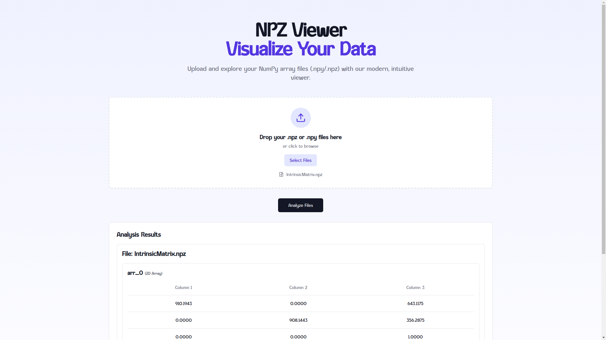
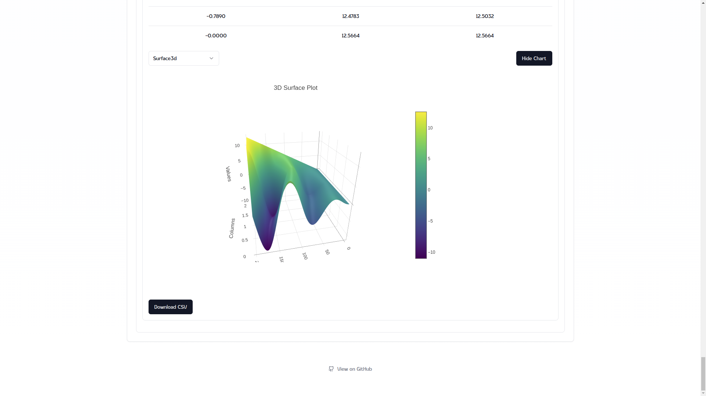
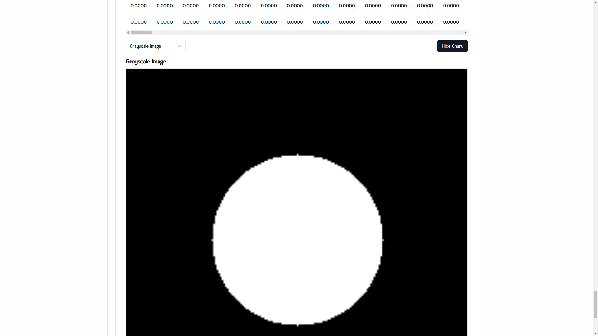
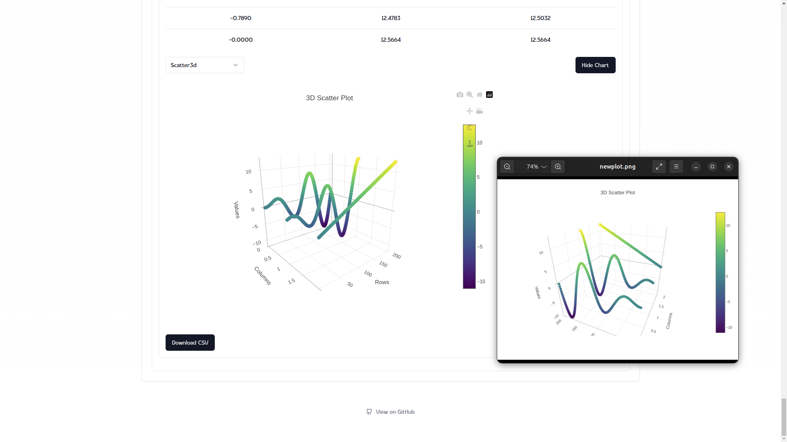

# 📊 NPZ/NPY Web Viewer 🌐

Welcome to the **NPZ/NPY Web Viewer**, a modern, feature-rich tool designed for interactive visualization and exploration of `.npz` and `.npy` files. 


---

## 🌟 Features

### 🔍 **File Support**
- Upload `.npz` or `.npy` files to visualize multidimensional arrays directly in your browser.
- Handles multiple arrays in a single `.npz` file seamlessly.

### 📈 **Multiple Visualization Options**
- View arrays with multiple chart types:
  - 🟠 **3D Scatter Plot**
  - 🟢 **3D Surface Plot**
  - 🔵 **Scatter Plot**
  - 🔗 **Line Chart**
  - ⚪ **Grayscale Image**
- Switch between chart types interactively for deeper insights.

### 💾 **Save & Download**
- **Download CSV**: Convert arrays into `.csv` files for easy sharing and analysis.
- **Save 3D Plots**: Export interactive 3D plots for use in presentations or reports.

### 🎛 **Interactive Interface**
- Intuitive dropdowns for selecting chart types.
- Dynamic resizing and rendering for smooth user experience.

### ⚡ **Fast and Efficient**
- Powered by modern frameworks:
  - Backend: **FastAPI** for robust data handling.
  - Frontend: **Next.js** with React for a seamless UI.

---

## 🛠️ Installation and Setup

### Prerequisites
- Node.js >= 14.x
- Python >= 3.9
- Docker

### Backend Setup
1. Clone the repository:
   ```bash
   git clone https://github.com/<your-username>/npz-web-viewer.git
   cd npz-web-viewer/backend
   ```

2. Install dependencies using Poetry:
   ```bash
   poetry install
   ```

3. Start the backend server:
   ```bash
   poetry run uvicorn app.main:app --reload
   ```

### Frontend Setup
1. Navigate to the frontend directory:
   ```bash
   cd ../frontend
   ```

2. Install dependencies:
   ```bash
   npm install
   ```

3. Start the development server:
   ```bash
   npm run dev
   ```

4. Access the app in your browser:
   ```
   http://localhost:3000
   ```

---

## 🎨 Screenshots

### 📊 Interactive Graphs



### 💾 Download Options


---

## 🚀 Docker

### Using Docker Compose

To run both the backend and the frontend services together:

1. **Navigate to the Project Root:**
   ```bash
   cd /path/to/your/project
   ```

2. **Run the Services:**
   Use the following command to start the backend and frontend:
   ```bash
   docker-compose up
   ```

   This will:
   - Build the backend and frontend Docker images.
   - Start the services and expose them on the following ports:
     - **Backend**: [http://localhost:8000](http://localhost:8000)
     - **Frontend**: [http://localhost:3000](http://localhost:3000)

---

### Running in Detached Mode
If you want the services to run in the background:
```bash
docker-compose up -d
```

---

### Environment Variables

1. **Backend:**
   - Ensure the `ALLOWED_ORIGINS` environment variable in the `.env` file includes the frontend URL (e.g., `http://localhost:3000`).

2. **Frontend:**
   - Set the `NEXT_PUBLIC_API_URL` in the frontend `.env` file to point to the backend URL:
     ```env
     NEXT_PUBLIC_API_URL=http://localhost:8000
     ```

---

## 📦 Features in Action

### 🌟 Upload and Explore Files
- View any `.npz` or `.npy` file effortlessly.

### 🔧 Transform and Analyze
- Switch between visualization modes:
  - 3D Scatter, 3D Surface, Line Chart, and more!

### 💾 Save and Share
- Export data as `.csv` or save interactive plots for offline use.

---

## 🧑‍💻 Contributing

We welcome contributions! Feel free to fork the repo and submit pull requests to improve this project.

---

## 📜 License

This project is licensed under the **BSD 3-Clause**. See the [LICENSE](LICENSE) file for details.

---


### 🌐 Check it out live [here](https://npz-web-viewer.vercel.app)
